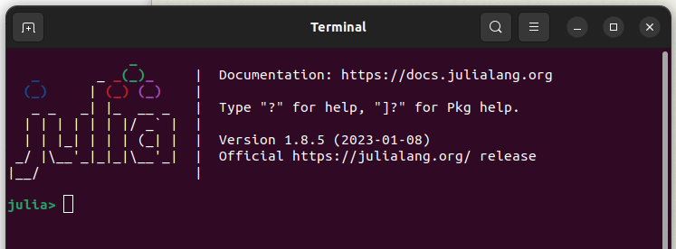

# Introduction to Julia programming

This repository hosts Jupyter notebooks as a hands-on introductory tutorial on Julia programming language for a one hour workshop coordinated by [DynaMORE](http://www.dynamore-project.eu) projct.

## How to use these notebooks?
Assuming that you have cloned/downloaded the notebookes:
- install Julia from [julialang.org](https://julialang.org/). Mind the help for your platform. You might need to add it's path manually specially in Windows.
    * click and run the Julia application (opens a terminal window)
    
    * the prompt at the command line `julia>` indicating the REPL. Here you can run julia commands
    * go to the cloned directory using `cd("path/to/the/directory")`
    * you can check the current working directory by `pwd()`
    * alternatively press `;` at REPL to have a "shell" prompt, `shell>`), you can use system commands like `cd` without parantheses here `cd path/to/the/directory`
    * you could use Terminal (cmd in Windows), `cd` to the cloned directory, run `julia`

- at Julia REPL press `]` to enter package manager (prompt changes to `(@v1.8) pkg>`), `(@v1.8)` indicating the general Julia environment. In Julia every project is isolated in an environment. 
- execute the following commands
    * `activate .`: prompt changes to `(JuliaMORE) pkg>`
    * `instantiate`: installs the required packages including `IJulia` for running the notebooks
- go back to REPL by pressing backspace and run
    * `using IJulia` makes the package available
    * `IJulia.notebook(dir=".")` starts a Jupyter dashboard on your default browser
        - the first time you run `notebook()`, it will prompt you to install Jupyter if it is not found
    * open `index.ipynb` in Jupyter dashboard and proceed
    * you might need to run `using Pkg` and then `Pkg.build("IJulia")` at REPL to complete the setup if you are unable to run `notebook()` properly
- alternatively you can use REPL without entering the package manager
    * `using Pkg`
    * `Pkg.activate(".")`
    * `Pkg.instantiate()`
    
- \[Optional:\] install VSCode from [code.visualstudio.com](https://code.visualstudio.com/). It looks like Rstudio :)
    * install [Julia plugin](https://www.julia-vscode.org/docs/dev/gettingstarted/#Installation-and-Configuration-1) for VSCode

<a rel="license" href="http://creativecommons.org/licenses/by/4.0/"></img></a>
